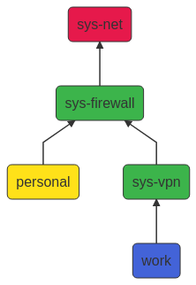

### qubes-tunnel service for Qubes OS

Manage, run, protect VPN connections in Proxy VMs.

This is closely based on the [Qubes-vpn-support](https://github.com/tasket/Qubes-vpn-support) project.



#### Installation:

Install `qubes-repo-contrib` package using `apt-get` or `dnf` in template. Then, install `qubes-tunnel` in the same way.

#### Setup

1. Create an AppVM, called for example `sys-vpn`, with the `provides network` option enabled using a template with the previously installed `qubes-tunnel` package. Make a choice for the NetVM setting, such as `sys-firewall`.

2. In `sys-vpn` settings `Services` tab, add `qubes-tunnel-openvpn` service.

> Note: There is no need for adding `network-manager` service.

3. As `root` or using `sudo`, in `sys-vpn` execute `/usr/lib/qubes/qtunnel-setup --config`:

   ```
   root@sys-vpn:/home/user# /usr/lib/qubes/qtunnel-setup --config

   Enter VPN/tunnel login credentials.
   Leave blank if not required...

   Username: fepitre
   Password: 

   Login info saved to /rw/config/qtunnel/tunneluserpwd.txt

   Done!
   Next, copy or link your config file to /rw/config/qtunnel/qtunnel.conf
   ```

4. Following what's the last sentence said, still as `root` or using `sudo`, in `sys-vpn` copy the OpenVPN config file from your service provider, for example called `user_config.ovpn` to `/rw/config/qtunnel/qtunnel.conf.conf`:

   ```
   root@sys-vpn:/home/user# cp user_config.ovpn /rw/config/qtunnel/qtunnel.conf
   ```

Restart `sys-vpn`. This will autostart the VPN client and you should see a popup notification 'LINK IS UP'!

Regular usage is simple: Just use `sys-vpn` as NetVM for other VMs and start them!


